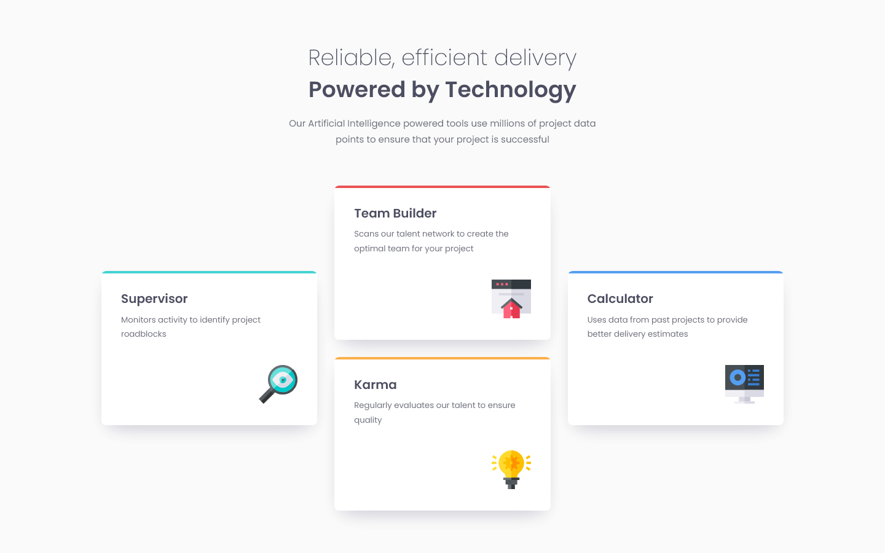

# Frontend Mentor - Four card feature section solution

This is a solution to the [Four card feature section challenge on Frontend Mentor](https://www.frontendmentor.io/challenges/four-card-feature-section-weK1eFYK). Frontend Mentor challenges help you improve your coding skills by building realistic projects.

This project features a **responsive layout** made in a **mobile-first workflow** with **Grid** and **media queries**.

## Overview

### The challenge

Users should be able to:

- View the optimal layout for the site depending on their device's screen size

### Links

- [Solution on Frontend Mentor](https://www.frontendmentor.io/solutions/responsive-cards-with-grid-pseudoelements-bem-and-accessible-colors-ZYQwAtR6NA)
- [Live Site on GitHub Pages](https://juliocinquina.github.io/fem-four-card-feature-section/)

### Screenshots

|                                Mobile                                 |     |                                 Desktop                                 |
| :-------------------------------------------------------------------: | :-: | :---------------------------------------------------------------------: |
|  |     |  |

## My process

### What I learned

In this project, I have practiced the following skills:

- Using **Grid** and **media queries** to create a **responsive layout**
- Using **pseudo-elements** for styling purposes
- Styling elements with **layered box-shadows**
- Using **semantic HTML markup**
- Using **Flexbox** to arrange content
- Improving **accessibility** by ensuring color contrast ratios comply with **WCAG 2.0 level AA**
- Using **CSS relative units** to ensure the text scales according to the user's font size settings
- Using **CSS custom properties** to allow easy customization and reusability of the component
- Using the **BEM naming convention** to create a reusable component
- Using **Git** and **GitHub**

---

#### Creating the colored top edge of the cards with a pseudo-element

The colored top edge of the cards was made using an absolutely-positioned `::before` pseudo-element, removing the need to create an empty element in the HTML markup.

In `.card`, `position: relative` is required to make it the nearest positioned ancestor of the absolutely-positioned `.card::before` pseudo-element. `overflow: hidden` makes the colored strip appear to follow the card's `border-radius` instead of overflowing out of it.

The color of the strip is defined in the `--card-top-edge-color` custom property, which has a "default" value in the `.card` class. This value is then modified in **modifier classes** — a part of the **BEM naming convention** —, making it easy to create additional cards with different colors, thus improving the **reusability** of the component.

```css
.card {
  --card-top-edge-color: var(--color-titles);
  /* ... */
  position: relative;
  overflow: hidden;
  /* ... */
}

.card::before {
  content: "";
  position: absolute;
  top: 0;
  left: 0;
  width: 100%;
  height: 0.25rem;
  background-color: var(--card-top-edge-color);
}

.card--cyan {
  --card-top-edge-color: var(--cyan);
}

.card--red {
  --card-top-edge-color: var(--red);
}

.card--orange {
  --card-top-edge-color: var(--orange);
}

.card--blue {
  --card-top-edge-color: var(--blue);
}
```

```html
<section class="card card--cyan"><!-- ... --></section>

<section class="card card--red"><!-- ... --></section>

<section class="card card--orange"><!-- ... --></section>

<section class="card card--blue"><!-- ... --></section>
```

### Continued development

In the future, I want to continue learning how to create **responsive, two-dimensional layouts** with **Grid**. Besides that, I want to continue learning how to create **beautiful shadows** with layered `box-shadow`s and (in future projects) the `drop-shadow()` function.

### Useful resources

- [_Designing Beautiful Shadows in CSS_ by Josh W. Comeau](https://www.joshwcomeau.com/css/designing-shadows/) - This article explains some concepts about shadows in websites and web applications, how to use them correctly and how to design beautiful shadows with CSS.
- [_Smoother & sharper shadows with layered box-shadows_ by Tobias Ahlin](https://tobiasahlin.com/blog/layered-smooth-box-shadows/) - This article (which was mentioned in the previous one) contains several examples of layered CSS box-shadows.

## Author

- Frontend Mentor - [@JulioCinquina](https://www.frontendmentor.io/profile/JulioCinquina)
